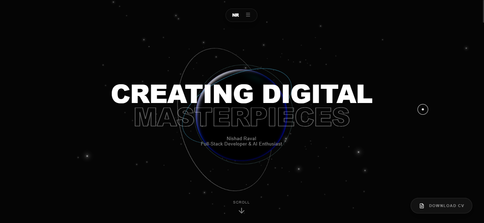

# 🎬 Nishad Raval - Cinematic Portfolio

> A high-performance, immersive portfolio website featuring 3D elements, smooth scroll physics, and award-winning "WOW" animations.


## ✨ Key Features

This portfolio was designed to feel **premium, interactive, and "alive"**. It goes beyond static websites with deep visual layers and physics-based interactions.

### 🔮 Mystic Sphere Hero
-   **Interactive 3D WebGL**: A dark matte sphere with procedural light strips that react to mouse movement (built with Three.js & React Three Fiber).
-   **Parallax Depth**: Elements float at different speeds for a 3D feel.

### 🧲 Magnetic UI
-   **Magnetic Buttons**: The "Resume" button and Footer links pull towards your cursor using spring physics.
-   **Smart Navbar**: The navigation capsule expands on hover and snaps to your movement.

### 🔄 Infinite Marquee Skills
-   **Smooth Ticker**: Skills scroll infinitely in two directions like a high-end ticker tape.
-   **Interactive Pause**: Hovering over any skill pauses the scroll and makes it glow with a cyan neon effect.

### 🎭 Parallax Reveal Footer
-   **Curtain Effect**: The footer is fixed behind the content. As you scroll through the Contact section, it "lifts up" to reveal the footer underneath.
-   **Real-Time Clock**: A live IST clock updates every second.

### 💊 Glassmorphism Resume Button
-   **Floating Action Button**: A frosted glass pill that follows you.
-   **Micro-Interactions**: The icon animates (arrow slides down) on hover.

---

## 🛠️ Tech Stack

Built with the modern **React Ecosystem** for maximum performance and developer experience.

-   **Runtime**: [Vite](https://vitejs.dev/) (Lightning fast HMR)
-   **Framework**: [React 18](https://react.dev/)
-   **Animations**: [Framer Motion](https://www.framer.com/motion/) (Complex gestures & layout transitions)
-   **3D Graphics**: [Three.js](https://threejs.org/) + [React Three Fiber](https://docs.pmnd.rs/react-three-fiber)
-   **Smooth Scroll**: [Lenis](https://lenis.studiofreight.com/) (Buttery smooth inertial scrolling)
-   **Icons**: [Lucide React](https://lucide.dev/)
-   **Styling**: Modern CSS3 (Variables, Glassmorphism, Gradients)

---

## 🚀 Getting Started

1.  **Clone the repository**
    ```bash
    git clone https://github.com/yourusername/portfolio.git
    cd portfolio
    ```

2.  **Install Dependencies**
    ```bash
    npm install
    ```

3.  **Run Development Server**
    ```bash
    npm run dev
    ```
    Open [http://localhost:5173](http://localhost:5173) to view it in the browser.

---

## 🎨 Customization Guide

-   **Resume**: Replace `public/Nishad Raval's Resume.pdf` with your file. Update the link in `src/components/ResumeButton.jsx`.
-   **Projects**: Edit the `projects` array in `src/components/Projects.jsx`.
-   **Skills**: Update the lists in `src/components/Skills.jsx`.
-   **Contact**: Configure your EmailJS keys in `src/components/Contact.jsx`.

---

## 📄 License

MIT © [Nishad Raval]
